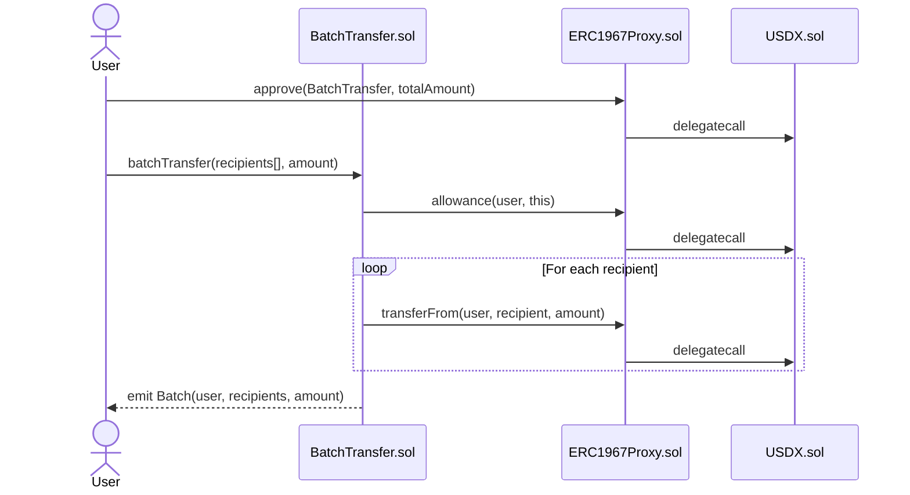
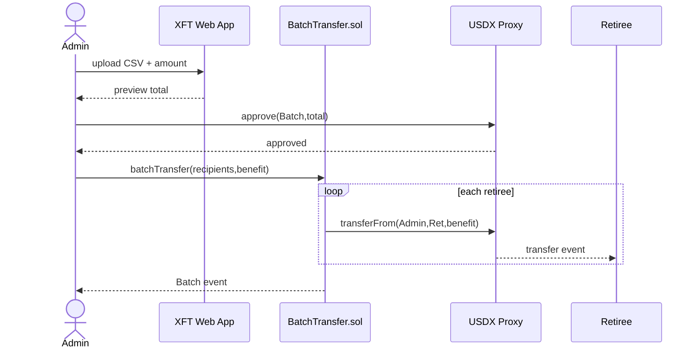

# XFT Batch Payments

BatchTransfer.sol enables sending identical USDX amounts to multiple recipients in one transaction. Use cases:

- **Pension Payments**: Monthly retiree benefits
- **Healthcare Claims**: Patient reimbursements
- **Tax Refunds**: Government returns
- **Disaster Relief**: Emergency aid
- **Utility Rebates**: Conservation incentives
- **Insurance Payouts**: Policy claims
- **Public Assistance**: Welfare benefits
- **Interest Payments**: Bond/loan earnings
- **Payroll**: Employee salaries
- **Customer Refunds**: Retail reimbursements
- **Grants**: Scholarship funding

Benefits: Gas efficiency, convenience, instant + 24/7/365 + global + transparent + immutable transaction record.

### User Flow - Batch Payments

1. User has 1000 USDX tokens
2. User approves BatchTransfer to spend 500 USDX
3. User calls batchTransfer([0xabc..., 0xdef...], 250)
4. 250 USDX sent to each recipient (500 total)
5. User has 500 USDX remaining


## BatchTransfer.sol  
- BatchTransfer.sol → ERC1967Proxy.sol → USDX Implementation





### Sepolia
- BatchTransfer.sol: [0xcE7234872b5957eB2d7C7C2eDab945DA3D37c681](https://sepolia.etherscan.io/address/0xcE7234872b5957eB2d7C7C2eDab945DA3D37c681)
- USDX.sol Proxy: [0x2f572059dbc598c8acfea4af06fe4f7669d1b3b1](https://sepolia.etherscan.io/address/0x2f572059dbc598c8acfea4af06fe4f7669d1b3b1)
- USDX.sol Implementation: [0xf6080682dFCa67A25F294343a03C8cd8675cc41E](https://sepolia.etherscan.io/address/0xf6080682dfca67a25f294343a03c8cd8675cc41e#code)


### BatchTransfer.sol
```
PUBLIC AND EXTERNAL FUNCTIONS
constructor(address _usdx): Sets USDX token address
batchTransfer(address[] calldata recipients, uint256 amount): Sends same USDX amount to multiple recipients

EVENTS
Batch(address indexed sender, address[] recipients, uint256 amount): Emitted after successful batch transfer.
```


### ABI
```json
[{"inputs":[{"internalType":"address","name":"_usdx","type":"address"}],"stateMutability":"nonpayable","type":"constructor"},{"anonymous":false,"inputs":[{"indexed":true,"internalType":"address","name":"sender","type":"address"},{"indexed":false,"internalType":"address[]","name":"recipients","type":"address[]"},{"indexed":false,"internalType":"uint256","name":"amount","type":"uint256"}],"name":"Batch","type":"event"},{"inputs":[],"name":"USDX","outputs":[{"internalType":"contract IUSDX","name":"","type":"address"}],"stateMutability":"view","type":"function"},{"inputs":[{"internalType":"address[]","name":"recipients","type":"address[]"},{"internalType":"uint256","name":"amount","type":"uint256"}],"name":"batchTransfer","outputs":[],"stateMutability":"nonpayable","type":"function"}]
```

### Shell Flow
```
npm install hardhat @nomicfoundation/hardhat-toolbox dotenv ethers
npx hardhat compile
npx hardhat run scripts/deploy.ts --network sepolia
```

### Deployment
This project demonstrates a basic Hardhat use case. It comes with a sample contract, a test for that contract, and a Hardhat Ignition module that deploys that contract.

Try running some of the following tasks:

```shell
npx hardhat help
npx hardhat test
REPORT_GAS=true npx hardhat test
npx hardhat node
npx hardhat ignition deploy ./ignition/modules/Lock.ts
```


```
git add .
git commit -m "X"
git push -f origin main
```

### RETIREMENT




**Benefits Demo Flow**:
- Admin uploads CSV with retiree addresses and benefit amount via XFT Web App.
- App shows total cost preview.
- Admin approves `BatchTransfer.sol` to spend USDX tokens.
- Admin calls `batchTransfer`, sending fixed benefit to each retiree.
- `BatchTransfer` loops, calling `transferFrom` on USDX proxy for each retiree.
- USDX emits `Transfer` events; `BatchTransfer` emits `Batch` event.
- Efficient: Single transaction for mass pension payouts.
